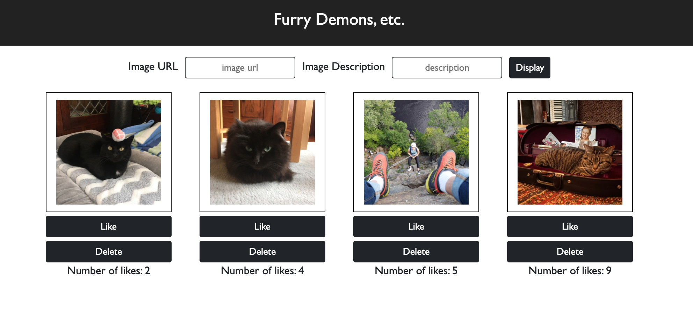

# Photo Gallery

## Description

This is a simple gallery app displaying images and their description.

Made using:

Javascript,
Node.js,
React,
Express,
Postico,
PostgresSQL,
and Bootstrap

This app allows the user to add an image via a url and an image description. The app requires that the user enters both a url and a description and displays an alert if one of these is missing. On click of 'display' button, this image and description will be added to the gallery.

User may "like" a photo, and the DOM displays the number of times the photo has been liked. Users can click on the photo to see a description of the photo. Clicking on the description toggles back to the photo. Clicking on the delete button will delete the entire image card.

